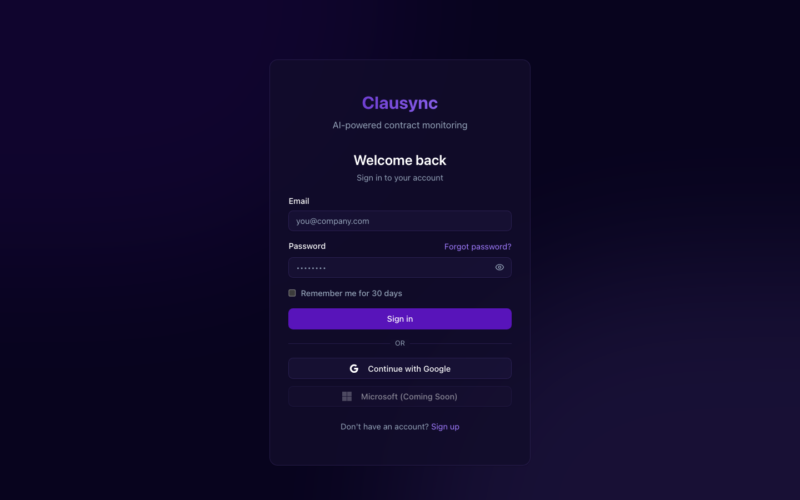
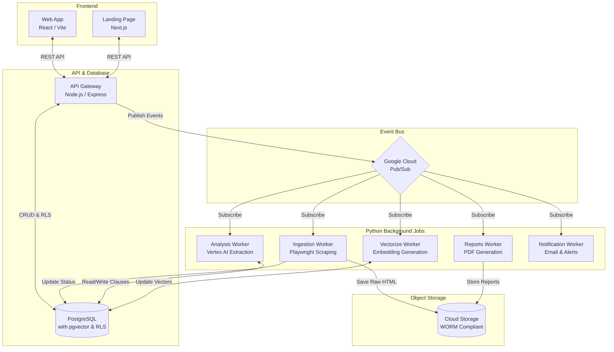

# ClauSync AI ⚡️

[](#)
[](#)
[](#)
[](#)
[](#)

ClauSync AI is an enterprise-grade, AI-powered contract analysis platform. It leverages distributed workers and vector embeddings to help legal teams understand, compare, and manage large volumes of complex legal documents at scale.



## 💡 The Problem & Solution
Legal teams spend countless hours manually parsing contracts to find specific clauses or identify compliance risks. ClauSync AI automates this process by employing a **"Singleton Resource Architecture"** combined with Large Language Models (LLMs) and Vector Search (`pgvector`) to instantly isolate, categorize, and flag risk within contracts.

---

## 🏗️ Architectural Highlights

This repository is built to scale and enforces strict boundaries suitable for enterprise deployment.



### 1. Strict Monorepo Discipline (Turborepo)
The codebase uses **Turborepo** and npm workspaces to perfectly isolate concerns:
- `packages/shared-schemas`: The single source of truth. JSON Schema definitions ensure strict contract definitions across the Node.js API and Python Workers, eliminating "poison pill" messages.
- `packages/ui`: A shared, centralized UI component library (`shadcn/ui` + Tailwind v4) that guarantees design consistency across the `web-app` (Vite) and `landing-page` (Next.js).
- `packages/backend-utils`: Houses the Prisma Client along with custom Row-Level Security (RLS) extensions to guarantee multi-tenant data isolation.

### 2. Event-Driven Microservices
The backend relies entirely on **Google Cloud Pub/Sub** for asynchronous compute. Heavy tasks are delegated to specific workers:
- `ingestion-worker`: Headless browser scraping (Playwright) and document parsing.
- `analysis-worker`: Clause extraction and anomaly detection via Vertex AI.
- `vectorize-worker`: Embedding generation for semantic search.

### 3. Enterprise Compliance & Security
- **WORM Storage:** Snapshots are stored in GCS buckets configured with `retention_policy` locks to guarantee Write Once, Read Many compliance for legal auditing.
- **Data Segregation:** The `packages/backend-utils` Prisma extension uses `$allModels` to automatically append `WHERE user_id = :tenant_id` to queries, protecting against accidental data leaks.

---

## 🛠️ Tech Stack

| Layer | Technologies |
| --- | --- |
| **Frontend** | React 19, Vite, Next.js, Tailwind CSS v4, React Query, Zustand |
| **Backend API** | Node.js, Express, Prisma ORM |
| **Data & AI** | PostgreSQL, `pgvector`, Python, Vertex AI |
| **Messaging** | Google Cloud Pub/Sub (with Dead Letter Queues) |
| **Infrastructure** | Docker, Terraform, Google Cloud Run, Secret Manager |

---

## 🚀 Developer Experience & Local Setup

We value developer experience. You can run the entire distributed architecture locally, or boot a lightweight version if you are just working on the API/UI.

### Prerequisites
- Docker & Docker Compose
- Node.js 20+

### The "Lite" Mode (Recommended for UI/API Devs)
To prevent OOM errors on standard machines, we provide a lite setup that only spins up Postgres and Redis.
```bash
git clone https://github.com/dave-manufor/clausync-ai.git
cd clausync-ai

# Start local databases only
docker-compose -f docker-compose.lite.yml up -d

# Install dependencies from the root to link monorepo packages
npm install

# Start the API and Frontend
npx turbo run dev --filter=api --filter=web-app
```

### The Full Environment
To test the entire distributed pipeline (including Pub/Sub Emulators, Fake-GCS, and all 9 Python workers):
```bash
docker-compose up
```

## License
MIT
