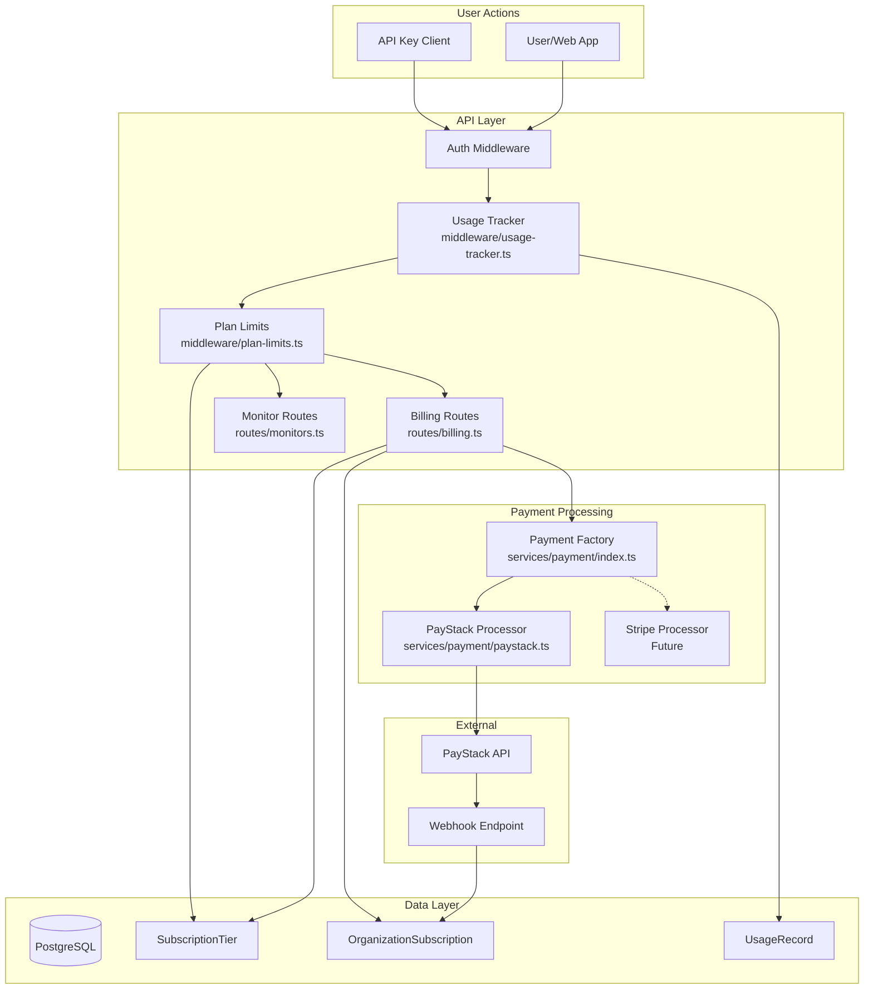
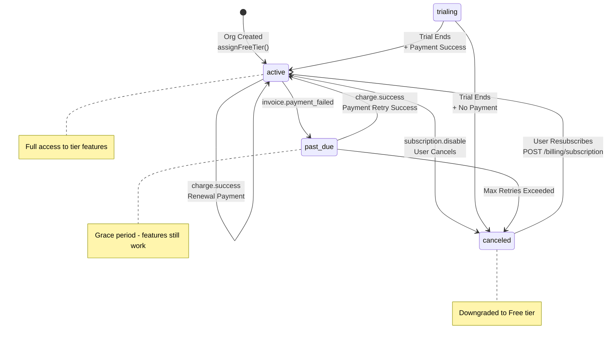
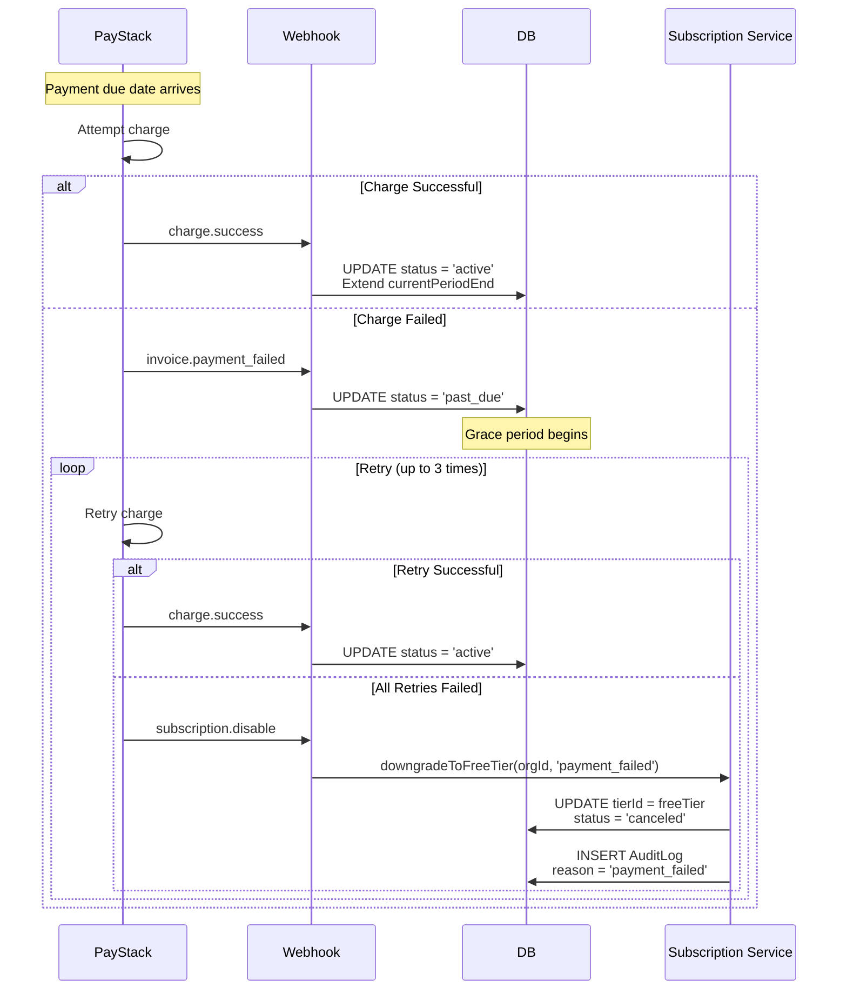
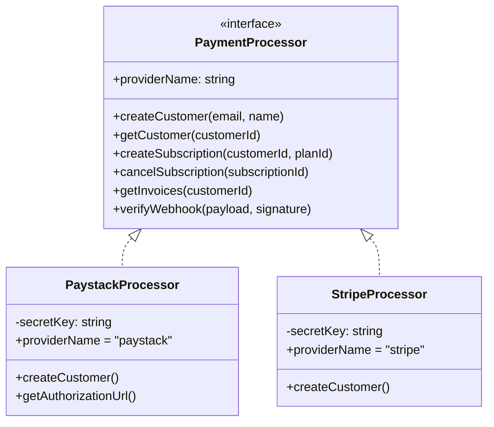
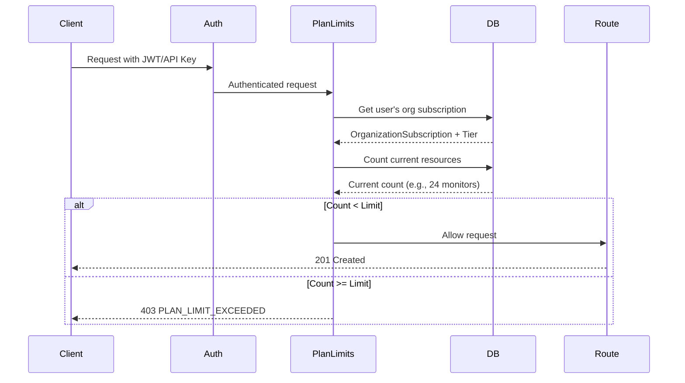
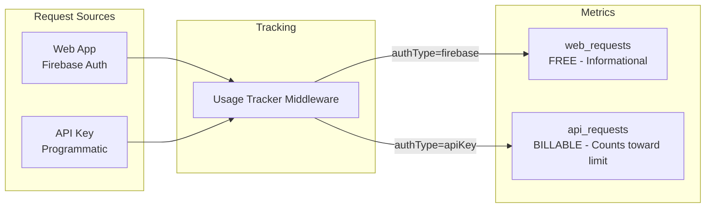
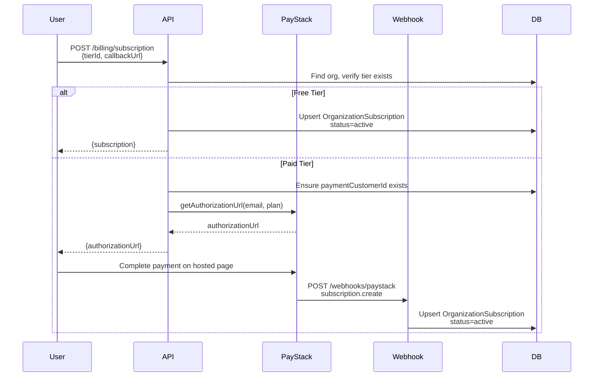
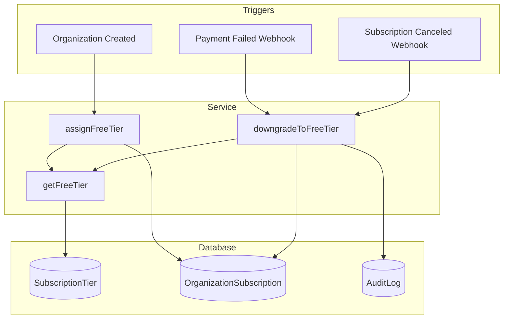
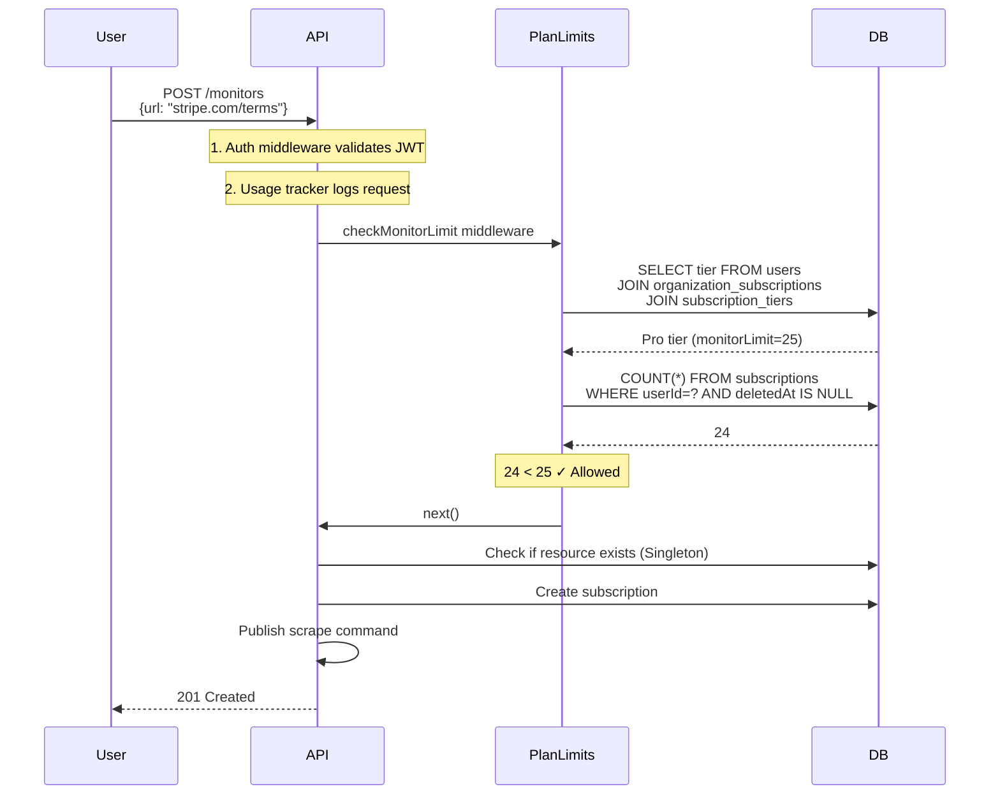

# Clausync Billing & Subscription System Walkthrough

This document provides a comprehensive breakdown of how subscriptions, payment, limits, usage tracking, and resource monitoring work in Clausync.

---

## System Architecture Overview



---

## Database Schema

### Core Models

#### 1. SubscriptionTier

Defines available subscription plans with their limits.

```prisma
model SubscriptionTier {
  id              String    @id @default(uuid())
  name            String    @unique // free, pro, business, enterprise
  displayName     String
  priceMonthly    Int       // cents (0 for free)
  priceYearly     Int       // cents
  currency        String    @default("USD")

  // Resource Limits
  monitorLimit    Int       // Max monitors per org
  teamLimit       Int       // Max team members
  documentLimit   Int       // Max RAG documents
  apiRateLimit    Int       // API requests per month
  webhookLimit    Int       // Webhook endpoints
  reportsPerMonth Int?      // null = unlimited

  // Features
  checkFrequency  String    @default("daily") // weekly, daily, hourly
  historyDays     Int       // How long to retain change history
  features        Json?     // Additional feature flags

  isActive        Boolean   @default(true) // false = archived
  subscriptions   OrganizationSubscription[]
}
```

#### 2. OrganizationSubscription

Links an organization to their active subscription tier.

```prisma
model OrganizationSubscription {
  id                    String    @id
  organizationId        String    @unique
  tierId                String
  paymentSubscriptionId String?   // PayStack/Stripe ID
  status                String    @default("trialing")
                                  // trialing, active, past_due, canceled, paused
  currentPeriodStart    DateTime?
  currentPeriodEnd      DateTime?
  trialEndsAt           DateTime?
  canceledAt            DateTime?
  cancelAtPeriodEnd     Boolean   @default(false)

  organization          Organization
  tier                  SubscriptionTier
}
```

#### 3. UsageRecord

Tracks usage metrics per organization per billing period.

```prisma
model UsageRecord {
  id             String   @id
  organizationId String
  metric         String   // api_requests, web_requests, reports_generated, ai_queries
  count          Int      @default(0)
  periodStart    DateTime // First day of month
  periodEnd      DateTime // Last day of month

  @@unique([organizationId, metric, periodStart])
}
```

### Subscription Status Lifecycle

The `OrganizationSubscription.status` field tracks the subscription state through various events:



### Status Transition Events

| From Status | To Status  | Trigger                  | Handler                      |
| ----------- | ---------- | ------------------------ | ---------------------------- |
| `(new)`     | `active`   | Organization created     | `assignFreeTier()`           |
| `active`    | `active`   | `charge.success`         | `handleChargeSuccess()`      |
| `active`    | `past_due` | `invoice.payment_failed` | `handlePaymentFailed()`      |
| `active`    | `canceled` | `subscription.disable`   | `handleSubscriptionCancel()` |
| `trialing`  | `active`   | Trial ends + payment     | Webhook handler              |
| `past_due`  | `active`   | `charge.success`         | `handleChargeSuccess()`      |
| `past_due`  | `canceled` | Max retries              | `downgradeToFreeTier()`      |
| `canceled`  | `active`   | User resubscribes        | `POST /billing/subscription` |

### Detailed Flow: Payment Failure to Recovery



---

## Payment Processor Architecture

### Abstraction Layer

The system uses a **Strategy Pattern** for payment processing, allowing hot-swapping between providers.



### Factory Pattern

[services/payment/index.ts](file:///Users/MAC/Dev/code/clausync-ai/apps/api/src/services/payment/index.ts):

```typescript
export function getPaymentProcessor(): PaymentProcessor {
  const processorType = process.env.PAYMENT_PROCESSOR || "paystack";

  switch (processorType) {
    case "stripe":
      throw new Error("Stripe not yet implemented");
    case "paystack":
    default:
      return new PaystackProcessor();
  }
}
```

### PayStack Integration

[services/payment/paystack.ts](file:///Users/MAC/Dev/code/clausync-ai/apps/api/src/services/payment/paystack.ts):

Key features:

- Customer creation/management
- Subscription lifecycle
- Invoice retrieval
- Webhook signature verification (HMAC-SHA512)
- Authorization URL for checkout redirect flow

---

## Plan Limits Enforcement

### Middleware Architecture

[middleware/plan-limits.ts](file:///Users/MAC/Dev/code/clausync-ai/apps/api/src/middleware/plan-limits.ts):



### Implementation

```typescript
// Get limits for a user's organization
export async function getPlanLimits(userId: string): Promise<PlanLimits> {
  const user = await prisma.user.findUnique({
    where: { identityProviderUid: userId },
    include: {
      organization: {
        include: {
          subscription: {
            include: { tier: true },
          },
        },
      },
    },
  });

  if (!user?.organization?.subscription?.tier) {
    return FREE_LIMITS; // Default fallback
  }

  return user.organization.subscription.tier;
}

// Middleware factory
export function requirePlanLimit(
  limitType: keyof PlanLimits,
  getCountFn: (userId: string) => Promise<number>
) {
  return async (req, res, next) => {
    const currentCount = await getCountFn(req.user.uid);
    const result = await checkLimit(req.user.uid, limitType, currentCount);

    if (!result.allowed) {
      return res.status(403).json({
        error: {
          code: "PLAN_LIMIT_EXCEEDED",
          message: `You have reached your ${limitType} limit (${result.limit})`,
        },
      });
    }
    next();
  };
}

// Pre-built middleware
export const checkMonitorLimit = requirePlanLimit(
  "monitorLimit",
  getMonitorCount
);
export const checkDocumentLimit = requirePlanLimit(
  "documentLimit",
  getDocumentCount
);
export const checkTeamLimit = requirePlanLimit("teamLimit", getTeamMemberCount);
```

### Enforcement Points

| Resource     | Limit Field     | Enforcement Point                 | Counter Function           |
| ------------ | --------------- | --------------------------------- | -------------------------- |
| Monitors     | `monitorLimit`  | `POST /monitors`                  | Count active subscriptions |
| Team Members | `teamLimit`     | `POST /organizations/:id/members` | Count org users            |
| Documents    | `documentLimit` | `POST /documents`                 | Count user documents       |
| Webhooks     | `webhookLimit`  | `POST /integrations/webhooks`     | Count org webhooks         |
| API Requests | `apiRateLimit`  | All API routes                    | Monthly usage record       |

---

## Usage Tracking

### Two Types of Request Tracking

[middleware/usage-tracker.ts](file:///Users/MAC/Dev/code/clausync-ai/apps/api/src/middleware/usage-tracker.ts):



### Implementation

```typescript
export async function trackApiUsage(req, res, next) {
  if (!req.user) return next();

  const isApiKeyRequest = req.authType === "apiKey";
  const metric: UsageMetric = isApiKeyRequest ? "api_requests" : "web_requests";

  // Track asynchronously to not block the request
  setImmediate(async () => {
    const user = await prisma.user.findUnique({
      where: { identityProviderUid: req.user.uid },
      select: { organizationId: true },
    });

    if (user?.organizationId) {
      await incrementUsage(user.organizationId, metric);
    }
  });

  next();
}
```

### Usage Service

[services/usage.ts](file:///Users/MAC/Dev/code/clausync-ai/apps/api/src/services/usage.ts):

```typescript
// Upsert pattern for atomic increment
export async function incrementUsage(
  organizationId: string,
  metric: UsageMetric,
  amount: number = 1
) {
  const { start, end } = getCurrentPeriod(); // First/last day of month

  await prisma.usageRecord.upsert({
    where: {
      organizationId_metric_periodStart: {
        organizationId,
        metric,
        periodStart: start,
      },
    },
    create: {
      organizationId,
      metric,
      count: amount,
      periodStart: start,
      periodEnd: end,
    },
    update: {
      count: { increment: amount },
    },
  });
}
```

---

## Billing API Endpoints

[routes/billing.ts](file:///Users/MAC/Dev/code/clausync-ai/apps/api/src/routes/billing.ts):

| Endpoint                       | Method | Description                       |
| ------------------------------ | ------ | --------------------------------- |
| `/api/v1/billing/tiers`        | GET    | List available subscription tiers |
| `/api/v1/billing/subscription` | GET    | Get current subscription status   |
| `/api/v1/billing/subscription` | POST   | Create/upgrade subscription       |
| `/api/v1/billing/subscription` | DELETE | Cancel subscription               |
| `/api/v1/billing/usage`        | GET    | Get current usage vs limits       |
| `/api/v1/billing/invoices`     | GET    | List payment history              |

### Subscription Flow



---

## Webhook Processing

[routes/paystack-webhook.ts](file:///Users/MAC/Dev/code/clausync-ai/apps/api/src/routes/paystack-webhook.ts):

### Event Types Handled

| Event                    | Action                                          |
| ------------------------ | ----------------------------------------------- |
| `subscription.create`    | Create/update OrganizationSubscription (active) |
| `subscription.not_renew` | Mark subscription canceled                      |
| `subscription.disable`   | Mark subscription canceled                      |
| `charge.success`         | Update subscription period, log payment         |
| `invoice.payment_failed` | Mark subscription past_due                      |

### Security

```typescript
// Webhook signature verification
verifyWebhook(payload: string, signature: string): WebhookEvent | null {
  const hash = crypto
    .createHmac('sha512', this.secretKey)
    .update(payload)
    .digest('hex');

  if (hash !== signature) {
    return null; // Invalid signature
  }

  return JSON.parse(payload);
}
```

---

## Automatic Free Tier Assignment

A dedicated subscription service handles free tier assignment automatically.

### Service Layer

[services/subscription.ts](file:///Users/MAC/Dev/code/clausync-ai/apps/api/src/services/subscription.ts):

| Function                             | Purpose                                       |
| ------------------------------------ | --------------------------------------------- |
| `getFreeTier()`                      | Gets free tier from DB, auto-seeds if missing |
| `assignFreeTier(orgId)`              | Assigns free tier to new organization         |
| `downgradeToFreeTier(orgId, reason)` | Downgrades org with audit log                 |

### Auto-Seeding

If the free tier doesn't exist in the database, `getFreeTier()` automatically creates it:

- 3 monitors
- Weekly checks
- No API access
- No documents
- 1 team member

### Integration Points



### Downgrade Reasons

| Webhook Event            | Downgrade Reason | Action                        |
| ------------------------ | ---------------- | ----------------------------- |
| `invoice.payment_failed` | `payment_failed` | Downgrade to free, log reason |
| `subscription.disable`   | `canceled`       | Downgrade to free, log reason |

---

## Real-World Example: Monitor Creation

### Scenario

User on **Pro** tier (25 monitor limit) with 24 active monitors tries to create a new one.

### Flow



### If Limit Exceeded

```json
// Response when user has 25 monitors and tries to create #26
{
  "success": false,
  "error": {
    "code": "PLAN_LIMIT_EXCEEDED",
    "message": "You have reached your monitorLimit limit (25). Please upgrade your plan.",
    "details": {
      "limit": 25,
      "current": 25,
      "limitType": "monitorLimit"
    }
  }
}
```

---

## Usage Dashboard Data

### GET /api/v1/billing/usage Response

```json
{
  "success": true,
  "data": {
    "usage": {
      "monitors": { "current": 24, "limit": 25 },
      "documents": { "current": 3, "limit": 5 },
      "teamMembers": { "current": 2, "limit": 3 },
      "apiRequests": {
        "current": 850,
        "limit": 1000,
        "billable": true
      },
      "webRequests": {
        "current": 1523,
        "limit": null,
        "billable": false
      }
    }
  }
}
```

---

## Key Design Decisions

### 1. Organization-Level Subscriptions

Subscriptions are tied to **organizations**, not individual users. This enables team billing.

### 2. API vs Web Request Separation

- **API Key requests** → Billable, counted toward `apiRateLimit`
- **Web App requests** → Free, tracked for analytics only

### 3. Free Tier Fallback

If a user has no organization or no subscription, they default to `FREE_LIMITS`:

```typescript
const FREE_LIMITS: PlanLimits = {
  monitorLimit: 3,
  teamLimit: 1,
  documentLimit: 0,
  apiRateLimit: 0,
  webhookLimit: 0,
  reportsPerMonth: 0,
};
```

### 4. Asynchronous Usage Tracking

Usage is tracked via `setImmediate()` to not block API responses.

### 5. Archiveable Tiers

`isActive: false` archives old tiers without breaking existing subscriptions.

---

## Files Reference

| File                                                                                                    | Purpose                         |
| ------------------------------------------------------------------------------------------------------- | ------------------------------- |
| [schema.prisma](file:///Users/MAC/Dev/code/clausync-ai/apps/api/prisma/schema.prisma)                   | Database models                 |
| [billing.ts](file:///Users/MAC/Dev/code/clausync-ai/apps/api/src/routes/billing.ts)                     | Billing API endpoints           |
| [plan-limits.ts](file:///Users/MAC/Dev/code/clausync-ai/apps/api/src/middleware/plan-limits.ts)         | Limit enforcement middleware    |
| [usage-tracker.ts](file:///Users/MAC/Dev/code/clausync-ai/apps/api/src/middleware/usage-tracker.ts)     | Request counting middleware     |
| [usage.ts](file:///Users/MAC/Dev/code/clausync-ai/apps/api/src/services/usage.ts)                       | Usage service (increment/query) |
| [payment/index.ts](file:///Users/MAC/Dev/code/clausync-ai/apps/api/src/services/payment/index.ts)       | Payment processor factory       |
| [payment/paystack.ts](file:///Users/MAC/Dev/code/clausync-ai/apps/api/src/services/payment/paystack.ts) | PayStack implementation         |
| [paystack-webhook.ts](file:///Users/MAC/Dev/code/clausync-ai/apps/api/src/routes/paystack-webhook.ts)   | Webhook handler                 |
