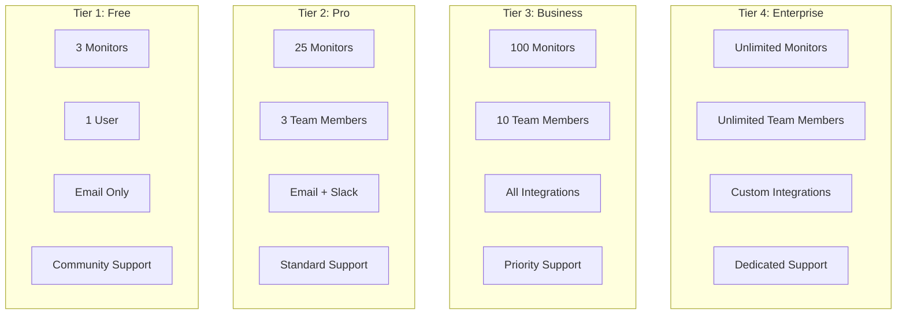

# Clausync.ai Subscription Tier Strategy

## Executive Summary

This document defines a 4-tier subscription model for Clausync.ai, designed to maximize user acquisition while maintaining profitability as a micro SaaS. The strategy leverages the **Singleton Architecture** cost advantage—where monitoring costs are shared across users tracking the same URLs.

---

## Cost Structure Analysis

Based on the [business-plan.md](file:///Users/MAC/Dev/code/clausync-ai/docs/business-plan.md):

| Cost Component           | Amount        | Notes                                                              |
| ------------------------ | ------------- | ------------------------------------------------------------------ |
| Fixed Infrastructure     | ~$67/mo       | Cloud SQL, Secrets Manager                                         |
| Per Monitored URL        | ~$0.32/mo     | Proxy + AI Analysis (amortized across all users tracking same URL) |
| Per Active User          | ~$0.05/mo     | RAG queries, storage                                               |
| Per Document (estimated) | ~$0.02/mo     | Vectorization + storage                                            |
| Per Report (estimated)   | ~$0.01/report | PDF/CSV generation                                                 |

> [!IMPORTANT]
> The Singleton Architecture means 100 users tracking the same URL share the $0.32 cost. This is the core profit lever.

---

## Tier Architecture

---

## Tier 1: Explorer (Free)

### Pricing

**$0/month** — Free forever

### Purpose

> Product-Led Growth (PLG) acquisition funnel. Let users experience value before committing.

### Capabilities

| Feature             | Limit                    | Rationale                                                                                     |
| ------------------- | ------------------------ | --------------------------------------------------------------------------------------------- |
| **Monitored URLs**  | 3                        | Enough to track 2-3 critical vendors (e.g., AWS, Stripe, Slack). Low enough to drive upgrade. |
| **Team Members**    | 1 (owner only)           | Solo use case. Prevents team abuse on free tier.                                              |
| **Check Frequency** | Weekly                   | Reduces scraping costs by 7x vs daily.                                                        |
| **AI Analysis**     | Tier 1 only (Global)     | "Traffic Light" risk scoring. No RAG personalization.                                         |
| **Document Upload** | None                     | RAG is a premium differentiator.                                                              |
| **Notifications**   | Email only               | Basic alerting, no integrations.                                                              |
| **Change History**  | 30 days                  | Limits WORM storage costs. Encourages upgrade for compliance.                                 |
| **Reports**         | None                     | Premium feature.                                                                              |
| **API Access**      | None                     | Prevents free tier automation abuse.                                                          |
| **Support**         | Community (forums, docs) | Zero support cost.                                                                            |

### Cost Analysis

- **Per User Cost**: ~$0.96/month (3 URLs × $0.32 weekly × 0.14 + $0.05 user)
- **Break-even**: Requires 1 in 50 users to upgrade to Pro

### Rationale

1. **3 monitors is the "magic number"** — Enough to be useful but creates urgency when tracking a 4th vendor.
2. **Weekly checks** dramatically reduce costs while still providing value.
3. **No RAG** — The personalized analysis is the killer feature that drives upgrades.
4. **30-day history** — Compliance-conscious users need 7-year WORM storage.

---

## Tier 2: Pro

### Pricing

**$29/month** or **$290/year** (save 17%)

### Purpose

> Core revenue driver for individuals, startups, and small teams.

### Capabilities

| Feature             | Limit                 | Rationale                                        |
| ------------------- | --------------------- | ------------------------------------------------ |
| **Monitored URLs**  | 25                    | Covers most startup vendor stacks.               |
| **Team Members**    | 3                     | Small team collaboration (founder + 2).          |
| **Check Frequency** | Daily                 | Full value of the monitoring service.            |
| **AI Analysis**     | Tier 1 + Tier 2 (RAG) | Personalized conflict detection!                 |
| **Document Upload** | 5 documents           | Upload MSA, privacy policy. Value demonstration. |
| **Notifications**   | Email + Slack         | Modern team communication.                       |
| **Webhooks**        | 1 endpoint            | Basic automation.                                |
| **Change History**  | 1 year                | Good retention for most use cases.               |
| **Reports**         | 5/month               | Manual report generation.                        |
| **API Access**      | 1,000 requests/month  | Light integration use.                           |
| **Support**         | Email (48h SLA)       | Standard support.                                |

### Cost Analysis

- **Per User Cost**: ~$8.00/month (25 × $0.32 + $0.05 + 5 docs × $0.02)
- **Gross Margin**: 72% ($21/user contribution)
- **Contribution to Fixed Costs**: Covers fixed costs at ~3 users

### Rationale

1. **$29 is below the "pain threshold"** for startups (can go on founder's personal card).
2. **25 monitors** is the "sweet spot" — Enough for a real use case, but growing companies will exceed.
3. **RAG included** — This is the primary upgrade driver from Free. Personalized analysis is a game-changer.
4. **Limited webhooks** — Encourages upgrade for integration-heavy workflows.
5. **Annual discount** — Improves cash flow and reduces churn.

---

## Tier 3: Business

### Pricing

**$99/month** or **$990/year** (save 17%)

### Purpose

> Mid-market companies with compliance requirements and growing SaaS stacks.

### Capabilities

| Feature              | Limit                  | Rationale                                                    |
| -------------------- | ---------------------- | ------------------------------------------------------------ |
| **Monitored URLs**   | 100                    | Covers mid-market vendor portfolio (avg. 100+ SaaS vendors). |
| **Team Members**     | 10                     | Legal team + key stakeholders.                               |
| **Check Frequency**  | Daily                  | Full monitoring cadence.                                     |
| **AI Analysis**      | Full (Tier 1 + Tier 2) | Complete personalization.                                    |
| **Document Upload**  | 25 documents           | Full policy library upload.                                  |
| **Notifications**    | All channels           | Email, Slack, MS Teams.                                      |
| **Webhooks**         | 10 endpoints           | Multi-system integration.                                    |
| **Change History**   | 3 years                | Serious compliance retention.                                |
| **Reports**          | 25/month + Scheduled   | Automated weekly/monthly reports.                            |
| **API Access**       | 10,000 requests/month  | Full API integration.                                        |
| **Team Routing**     | ✓                      | Route alerts by type (Privacy → DPO, Liability → Legal).     |
| **Custom Selectors** | ✓                      | Monitor specific page sections (not just full page).         |
| **Support**          | Email + Chat (24h SLA) | Priority support.                                            |

### Cost Analysis

- **Per User Cost**: ~$32.50/month (100 × $0.32 + 10 × $0.05 + 25 docs × $0.02)
- **Gross Margin**: 67% ($66.50/user contribution)
- **Break-even (this tier alone)**: 1 user covers monthly infrastructure

### Rationale

1. **$99 is the "team plan threshold"** — Requires procurement approval at most companies, but easy to justify.
2. **100 monitors** matches mid-market vendor stacks. Research shows avg. enterprise uses 130+ SaaS tools.
3. **Team Routing** is the killer feature — Legal, Security, Privacy teams need different alerts.
4. **Scheduled Reports** enable "hands-off" compliance reporting.
5. **3-year history** bridges the gap between casual use and full compliance.

---

## Tier 4: Enterprise

### Pricing

**$499/month** or **$4,990/year** (save 17%)
_Custom pricing available for large deployments_

### Purpose

> Large enterprises with regulatory requirements, extensive vendor portfolios, and complex team structures.

### Capabilities

| Feature             | Limit                   | Rationale                                   |
| ------------------- | ----------------------- | ------------------------------------------- |
| **Monitored URLs**  | Unlimited\*             | \*Fair use: 500 included, $0.50/URL beyond. |
| **Team Members**    | Unlimited               | Full organization deployment.               |
| **Check Frequency** | Custom (up to hourly)   | Critical vendor monitoring.                 |
| **AI Analysis**     | Full + Custom prompts   | Tailored analysis for specific industries.  |
| **Document Upload** | Unlimited               | Complete policy corpus.                     |
| **Notifications**   | All + Custom            | PagerDuty, custom webhooks, SMS.            |
| **Webhooks**        | Unlimited               | Full integration architecture.              |
| **Change History**  | 7 years (WORM)          | Full legal compliance vault.                |
| **Reports**         | Unlimited + White-label | Board-ready compliance reports.             |
| **API Access**      | Unlimited               | Full API integration.                       |
| **SSO/SAML**        | ✓                       | Enterprise identity management.             |
| **Data Residency**  | ✓                       | Choose region (US, EU, APAC).               |
| **Audit Logs**      | ✓                       | SOC 2 / GDPR compliance.                    |
| **SLA**             | 99.9% uptime            | Contractual guarantee.                      |
| **Support**         | Dedicated CSM + Phone   | White-glove support.                        |

### Cost Analysis

- **Per User Cost**: ~$160/month (500 × $0.32 = $160 base)
- **Gross Margin**: 68% ($339/user contribution)
- **High-touch**: Expect longer sales cycles, but higher LTV

### Rationale

1. **$499 is "enterprise table stakes"** — Signals seriousness to procurement.
2. **Unlimited team members** — Removes friction for large deployments.
3. **7-year WORM storage** — Full legal admissibility (matches the PRD requirement).
4. **SSO/SAML** — Required for enterprise security policies.
5. **Data Residency** — GDPR compliance for EU customers.
6. **Dedicated CSM** — Reduces churn, increases expansion revenue.

---

## Tier Comparison Matrix

| Feature                  | Explorer (Free) | Pro ($29) | Business ($99)    | Enterprise ($499) |
| ------------------------ | --------------- | --------- | ----------------- | ----------------- |
| **Monitors**             | 3               | 25        | 100               | Unlimited\*       |
| **Team Members**         | 1               | 3         | 10                | Unlimited         |
| **Check Frequency**      | Weekly          | Daily     | Daily             | Custom            |
| **Global AI Analysis**   | ✓               | ✓         | ✓                 | ✓                 |
| **RAG Personalization**  | ✗               | ✓         | ✓                 | ✓                 |
| **Document Upload**      | ✗               | 5         | 25                | Unlimited         |
| **Email Notifications**  | ✓               | ✓         | ✓                 | ✓                 |
| **Slack Integration**    | ✗               | ✓         | ✓                 | ✓                 |
| **MS Teams Integration** | ✗               | ✗         | ✓                 | ✓                 |
| **Webhooks**             | ✗               | 1         | 10                | Unlimited         |
| **Change History**       | 30 days         | 1 year    | 3 years           | 7 years (WORM)    |
| **Reports**              | ✗               | 5/mo      | 25/mo + Scheduled | Unlimited         |
| **API Access**           | ✗               | 1,000/mo  | 10,000/mo         | Unlimited         |
| **Team Routing**         | ✗               | ✗         | ✓                 | ✓                 |
| **Custom Selectors**     | ✗               | ✗         | ✓                 | ✓                 |
| **SSO/SAML**             | ✗               | ✗         | ✗                 | ✓                 |
| **Data Residency**       | ✗               | ✗         | ✗                 | ✓                 |
| **Audit Logs Export**    | ✗               | ✗         | ✗                 | ✓                 |
| **SLA**                  | ✗               | ✗         | ✗                 | 99.9%             |
| **Support**              | Community       | Email 48h | Email+Chat 24h    | Dedicated CSM     |

---

## Revenue Model Projections

Based on typical SaaS conversion rates and the business plan targets:

### Year 1 Assumptions

- **Total Signups**: 2,000 free users
- **Free → Pro Conversion**: 5% (100 users)
- **Pro → Business Upgrade**: 20% of Pro (20 users)
- **Direct Enterprise Sales**: 3 accounts

### Monthly Revenue Projection

| Tier          | Users     | MRR        | Notes               |
| ------------- | --------- | ---------- | ------------------- |
| Free          | 1,877     | $0         | Acquisition funnel  |
| Pro           | 80        | $2,320     | Core revenue        |
| Business      | 20        | $1,980     | Growth segment      |
| Enterprise    | 3         | $1,497     | High-value accounts |
| **Total MRR** | **1,980** | **$5,797** | Exceeds BEP target  |

### Cost Structure at Scale

| Cost                                  | Monthly     |
| ------------------------------------- | ----------- |
| Fixed Infrastructure                  | $67         |
| Variable (URLs, estimated 500 unique) | $160        |
| AI Processing                         | ~$50        |
| Support (1 contract FTE at scale)     | ~$1,000     |
| **Total Costs**                       | **~$1,277** |
| **Gross Profit**                      | **~$4,520** |
| **Gross Margin**                      | **78%**     |

---

## Strategic Rationale Summary

### 1. Free Tier (Explorer)

> **Why:** Product-Led Growth is essential for micro SaaS. Users must experience the "aha moment" (seeing a vendor change detected) before paying.
>
> **Guardrails:** Weekly checks + 3 monitors prevent abuse while delivering value.

### 2. Pro Tier ($29)

> **Why:** The "easy yes" for individuals and small teams. Below the pain threshold for personal cards.
>
> **Anchor:** RAG personalization is the primary upgrade driver. Without it, users are "flying blind."

### 3. Business Tier ($99)

> **Why:** Team collaboration and compliance features justify 3x price jump. Team Routing is gold for multi-stakeholder orgs.
>
> **Anchor:** Scheduled Reports + 3-year history for compliance-conscious mid-market.

### 4. Enterprise Tier ($499)

> **Why:** Full feature access + white-glove support. 7-year WORM storage is legally defensible.
>
> **Anchor:** SSO/SAML is table stakes. Data residency is required for EU enterprise.

---

## Implementation Considerations

> [!WARNING]
> This tier structure requires implementing several features that may not yet exist in the current codebase:
>
> - Check frequency configuration per subscription
> - Document upload limits
> - Report generation limits
> - API rate limiting per tier
> - Team member limits
> - Change history retention policies
> - SSO/SAML integration

### Database Schema Changes

The `Subscription` model will need:

- `tier` enum (FREE, PRO, BUSINESS, ENTERPRISE)
- `monitor_limit` integer
- `team_member_limit` integer
- `document_limit` integer
- `check_frequency` enum (WEEKLY, DAILY, HOURLY)
- `history_retention_days` integer
- `api_rate_limit` integer

### Enforcement Points

1. **Monitor creation** — Check against `monitor_limit`
2. **Team invitation** — Check against `team_member_limit`
3. **Document upload** — Check against `document_limit`
4. **API requests** — Rate limit per tier
5. **Report generation** — Monthly quota tracking

---

## User Review Required

> [!IMPORTANT] > **Pricing Validation Needed**
> The pricing ($29/$99/$499) is based on competitive analysis and unit economics, but should be validated with potential customers before launch.

> [!IMPORTANT] > **Feature Prioritization**
> Some features (SSO, Team Routing, Custom Selectors) may require significant development effort. Consider phased rollout.

---

## Next Steps

1. [ ] Validate pricing with 5-10 target customers
2. [ ] Prioritize feature development for each tier
3. [ ] Implement billing integration (Stripe)
4. [ ] Design upgrade/downgrade flows
5. [ ] Create marketing landing page for each tier
